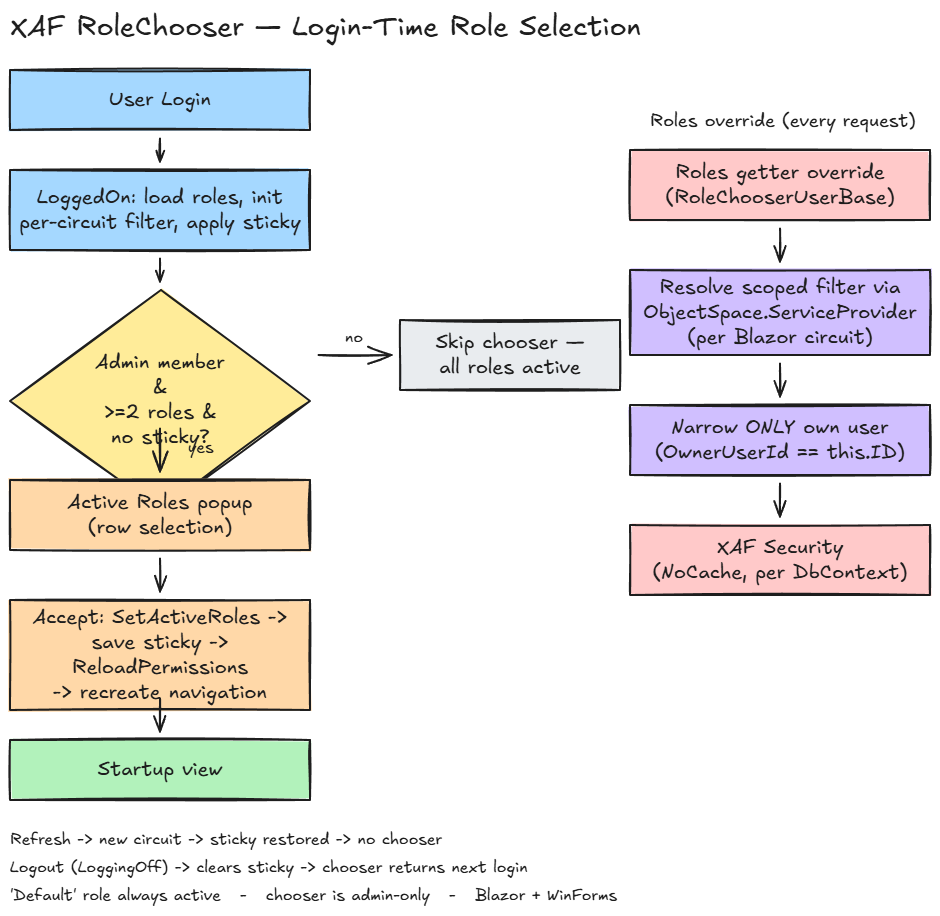

# XAF Role Chooser

**A reusable DevExpress XAF module that lets users choose which roles are active after login.**

Built with .NET 8 | DevExpress XAF v25.2 | EF Core | SQL Server



---

## The Problem

In standard XAF security, all roles assigned to a user are always active. Every permission from every role is applied simultaneously, and there is no built-in mechanism for a user to temporarily operate with reduced permissions.

This creates real problems in several scenarios:

- **Users with multiple roles who want to work in a specific capacity.** A user assigned both "Manager" and "Admin" may want to perform day-to-day work as a Manager only, without the elevated access that comes with Admin. There is no way to do this out of the box.

- **Security-conscious environments where elevated roles should only be activated when needed.** This is the same principle behind `sudo` on Unix systems — you operate with normal privileges by default and explicitly escalate only when required. XAF offers no equivalent.

- **Testing and auditing.** When verifying what a user can see or do with a specific combination of roles, the only option today is to modify role assignments in the database, which is disruptive and error-prone. With Role Chooser, a user can choose which of their assigned roles to activate right at login, then re-login to try a different combination — no database edits needed.

- **Compliance scenarios requiring the principle of least privilege.** Regulatory frameworks (SOX, HIPAA, ISO 27001) often mandate that users operate with the minimum permissions necessary. Always-on roles make this difficult to enforce or demonstrate.

XAF Role Chooser solves all of these by letting users selectively activate their assigned roles after login.

---

## How It Works

### User Experience

1. The user logs in normally.
2. If they have **two or more** optional roles (any role besides "Default"), a popup listing those roles appears automatically, before they start working.
3. The user selects which roles to activate for the session and clicks **Accept** — or clicks **Cancel** to keep all roles active.
4. If the user has fewer than two optional roles, the popup is skipped and all roles are active.
5. The choice is final for the session. To try a different combination, the user logs out and back in — there is no mid-session switching.

### Technical Mechanism

The module works by intercepting the point where XAF reads a user's roles for permission evaluation, and by showing the chooser once, automatically, right after login:

- **`RoleChooserUserBase`** inherits from `PermissionPolicyUser` and overrides the `Roles` property. In EF Core, this property is virtual, which makes the override possible. The overridden getter is a **pass-through** to the live tracked collection unless the user actually narrowed their session selection (deselected at least one optional role) — only then does it return a filtered, detached snapshot. This is what lets role assignment edits (Link/Unlink) on the User DetailView persist normally in an all-roles session.

- **`RoleChooserWindowController`** subscribes to `XafApplication.ViewShown` and shows the popup on the first view shown after login, then unsubscribes. (`Window.ViewChanged` doesn't work for this: in XAF Blazor's tabbed MDI, views land on MDI child windows, never on the main window.)

- **`RoleFilterAccessor`** uses a `ConcurrentDictionary<Guid, IActiveRoleFilter>` keyed by user ID to provide thread-safe access to the active role filter. This is necessary because EF Core entities are not created through dependency injection, and `AsyncLocal<T>` does not survive Blazor Server's async boundaries. The dictionary lookup ensures the correct filter is used regardless of thread context.

- **`PermissionsReloadMode.NoCache`** ensures that the security system re-evaluates permissions on every `DbContext` operation rather than caching them for the session. This is what makes the login-time role selection take effect immediately once accepted, instead of requiring a fresh login to apply. This is the default mode in XAF, so no configuration is typically needed.

- **`SecuritySystem.ReloadPermissions()`** is called when the user clicks **Accept** in the chooser popup. This forces the security system to immediately re-read the (now filtered) roles and recalculate all permissions. Cancelling doesn't need it — all roles were already active since login.

---

## Quick Start

### 1. Add a project reference

```bash
# From your XAF solution directory
dotnet add reference path/to/RoleChooser.csproj
```

When the module is published as a NuGet package, this will become a `dotnet add package` command instead.

### 2. Update your ApplicationUser

Your `ApplicationUser` class needs to inherit from `RoleChooserUserBase` instead of `PermissionPolicyUser`:

```csharp
using RoleChooser.Security;

public class ApplicationUser : RoleChooserUserBase, ISecurityUserWithLoginInfo
{
    // All existing code remains unchanged.
    // RoleChooserUserBase inherits from PermissionPolicyUser,
    // so everything that worked before continues to work.
}
```

### 3. Register services in Startup.cs

```csharp
using RoleChooser;

services.AddRoleChooser();
```

This registers the `IActiveRoleFilter` service and the `RoleFilterAccessor` that makes the filter available to entities.

### 4. Register the module

```csharp
builder.Modules
    .Add<RoleChooserModule>();
```

This adds the window controller, business objects, and module configuration to your XAF application.

### 5. Ensure PermissionsReloadMode.NoCache

This is the default in XAF, so you usually do not need to do anything. If your application explicitly sets a different mode, change it back:

```csharp
((SecurityStrategy)securityStrategy).PermissionsReloadMode = PermissionsReloadMode.NoCache;
```

The module will log a warning at startup if it detects a caching mode that would prevent role changes from taking effect.

---

## Configuration

The module has a single configuration option: the name of the role that is always active and cannot be deactivated.

```csharp
// Change the always-active role name (default: "Default")
.Add<RoleChooserModule>(m => m.AlwaysActiveRoleName = "BaseRole");
```

The always-active role is excluded from the role chooser popup entirely. It is always applied to the user regardless of their selections. This ensures that users always have a baseline set of permissions (typically navigation access and basic read permissions).

---

## Architecture

```
┌─────────────────────────────────────────────────────────┐
│                    XAF Application                       │
│                                                         │
│  ┌────────────────────┐   ┌───────────────────────────┐ │
│  │ RoleChooser         │   │ ApplicationUser            │ │
│  │ WindowController    │   │ : RoleChooserUserBase      │ │
│  │                    │   │                           │ │
│  │ Auto via ViewShown │   │ Roles → filtered by ──────┼─┼──► SecurityStrategy
│  │      ↓             │   │        IActiveRoleFilter   │ │   evaluates only
│  │ Popup ListView     │   │ GetAllRoles() → raw SQL   │ │   active roles
│  │      ↓             │   └───────────────────────────┘ │
│  │ IActiveRoleFilter  │◄── ConcurrentDict<UserId> ─────┤
│  └────────────────────┘     RoleFilterAccessor           │
└─────────────────────────────────────────────────────────┘
```

The key insight is the separation between `Roles` (filtered, used by the security system) and the raw SQL role loading at login (unfiltered, used to populate the role chooser). The `NonPersistentObjectSpace.ObjectsGetting` event is used to populate the popup ListView with `ActiveRoleSelection` objects. The `ConcurrentDictionary` bridge in `RoleFilterAccessor` connects the controller layer (which has DI access) to the entity layer (which does not).

---

## Project Structure

```
├── src/RoleChooser/              # Reusable module (THE deliverable)
│   ├── BusinessObjects/          # ActiveRoleSelection (NonPersistent)
│   ├── Controllers/              # RoleChooserWindowController
│   ├── Security/                 # RoleChooserUserBase, RoleFilterAccessor
│   ├── Services/                 # IActiveRoleFilter, ActiveRoleFilter
│   ├── RoleChooserModule.cs      # Module definition
│   └── RoleChooserServiceExtensions.cs
├── XafRoleChooser/               # Demo application
│   ├── XafRoleChooser.Module/    # Shared demo module
│   ├── XafRoleChooser.Blazor.Server/  # Blazor Server frontend
│   └── XafRoleChooser.Win/       # WinForms frontend
├── tests/
│   └── XafRoleChooser.Playwright/  # E2E tests
├── docs/
│   ├── how-to-implement.md       # Integration guide
│   └── plans/                    # Design documents
└── docker-compose.yml            # SQL Server 2022 for dev
```

The `src/RoleChooser/` directory is the reusable module — the actual deliverable of this project. Everything else (the `XafRoleChooser/` demo application, tests, docs) exists to demonstrate and validate the module.

---

## Running the Demo

### Prerequisites

- [.NET 8 SDK](https://dotnet.microsoft.com/download/dotnet/8.0)
- [Docker](https://www.docker.com/products/docker-desktop/) (for SQL Server)
- DevExpress NuGet feed configured (requires a DevExpress license)

### Steps

```bash
# Start the SQL Server 2022 container
docker compose up -d

# Update the connection string in appsettings.Development.json
# Use the DockerConnectionString value

# Run the Blazor Server app
dotnet run --project XafRoleChooser/XafRoleChooser.Blazor.Server
```

### Test Users

The demo application seeds the following users. All passwords are empty.

| User | Roles | Chooser |
|---|---|---|
| **Admin** | Default, Administrators, HR Manager, Project Manager, Sales, Finance | Appears (5 optional roles) |
| **MultiRole** | Default, Administrators, HR Manager, Project Manager, Sales, Finance | Appears (5 optional roles) |
| **User** | Default only | Skipped — only Default active |
| **SingleRole** | Default, Sales | Skipped — both active (only 1 optional role) |

Log in as **MultiRole** to get the full experience — the chooser will show all 5 optional roles at login. Select a subset and accept to see navigation and data access reflect only those roles for the rest of the session; log out and back in to try a different combination. Log in as **SingleRole** or **User** to see the chooser skipped entirely.

---

## Running Tests

The test suite uses [Playwright for .NET](https://playwright.dev/dotnet/) to run end-to-end tests against the Blazor Server application.

```bash
# Build the test project
dotnet build tests/XafRoleChooser.Playwright

# Install Playwright browsers (first time only)
pwsh tests/XafRoleChooser.Playwright/bin/Debug/net8.0/playwright.ps1 install

# Run tests (requires the Blazor app to be running)
dotnet test tests/XafRoleChooser.Playwright
```

The tests require a running instance of the Blazor Server application and a seeded database. Start the demo application first before running the test suite.

---

## Key Design Decisions

| Decision | Rationale |
|---|---|
| Login-time selection, not mid-session switching | An earlier version let users change roles anytime with live updates. It was abandoned: the `Roles` override returned a detached copy while filtering, so an admin's Link/Unlink writes on the User detail view silently vanished (a permission believed revoked was not), and switching mid-session required fragile forced-teardown of open views and navigation. Choosing once at login — before any view or cache exists — lets the override stay pass-through except in a narrowed session (so role administration works) and eliminates the teardown machinery. Cost: changing roles needs a re-login. See [`docs/how-to-implement.md`](docs/how-to-implement.md) → "Why Login-Time Selection". |
| Override `Roles` property | This is the only reliable interception point. XAF has no public API to filter roles before permission evaluation. Because EF Core makes navigation properties virtual, the override works cleanly without reflection or patching. |
| `ConcurrentDictionary` accessor | Entities loaded by EF Core are not created through dependency injection. `AsyncLocal<T>` does not survive Blazor Server's async boundaries, so a `ConcurrentDictionary<Guid, IActiveRoleFilter>` keyed by user ID is used instead. |
| `PermissionsReloadMode.NoCache` requirement | Ensures permissions are re-read per `DbContext` operation, picking up the login-time role selection immediately once accepted. Without this, the `ReloadPermissions()` call the chooser makes would have no effect, and the user would keep the full pre-selection permission set for the whole session. |
| No role dependencies | YAGNI. Each role is an independent toggle. If a project needs role dependencies (e.g., "activating Manager also activates Employee"), that logic can be layered on top of the module without modifying it. |
| `PopupWindowShowAction` | This is the standard XAF pattern for modal popups. It works identically on both Blazor Server and WinForms without any platform-specific code, which keeps the module cross-platform with zero conditional compilation. |

---

## Limitations & Known Behavior

The active-role selection is a **login-time** choice, remembered **server-side, per user** (not in a cookie or browser storage). A few consequences are worth knowing:

- **A newly-granted role won't appear until the user logs off and back on.** The last selection is remembered per user and re-applied silently on the next login, so a browser refresh doesn't re-prompt. It is *not* reconciled against the user's current role membership — if an administrator grants a user a new role, it stays inactive and the chooser won't re-offer it until that user explicitly logs off and logs in again. Because the state is server-side and keyed by user id, clearing browser history/cookies (or switching machines) does **not** reset it; only an in-app logout or an application restart does.
- **Narrowing applies to the interactive (Blazor) session only.** It is not applied to stateless Web API / OData requests, which use the user's full role set.
- **Concurrent sessions of the same account share one selection.** Logging out of one session resets the selection for all live sessions of that account (their chooser reappears on the next refresh).

---

## Requirements

- **.NET 8.0** or later
- **DevExpress XAF v25.2** or later (EF Core data access provider)
- **SQL Server** — LocalDB, Docker, or a remote instance
- **`PermissionsReloadMode.NoCache`** — this is the default in XAF. The module will warn at startup if a different mode is detected.

---

## License

MIT License — see [LICENSE](LICENSE) file.

---

## Contributing

Contributions are welcome. Please open an issue first to discuss proposed changes before submitting a pull request.
